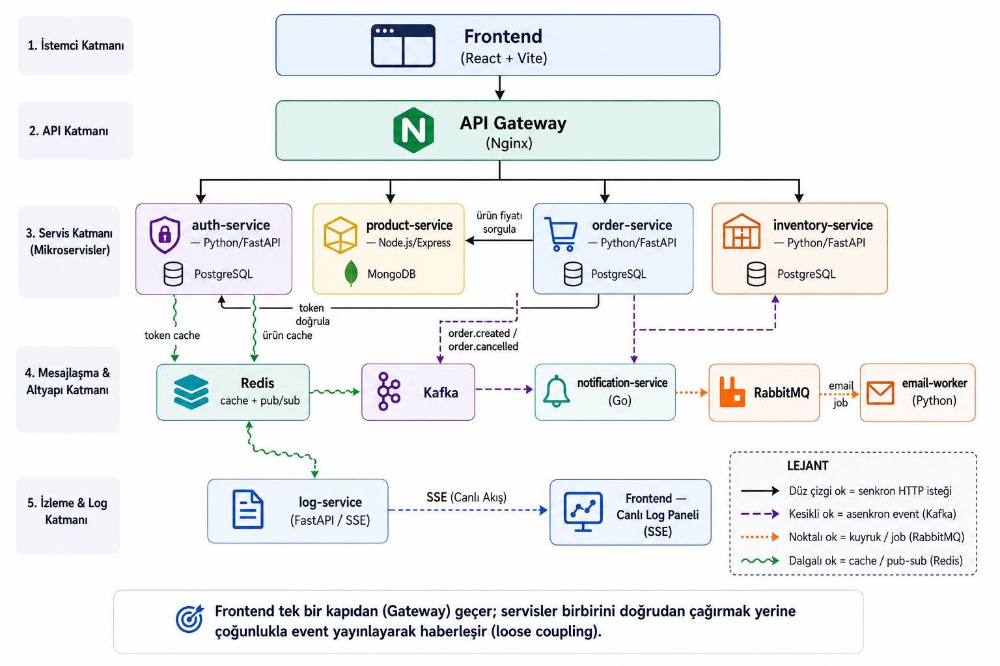

# Mikroservis Örnek Uygulama

Öğrenim amaçlı, production-grade teknoloji yığını kullanan bir e-ticaret platformu.  
Mikroservis mimarisinin temel kavramlarını — polyglot stack, event-driven iletişim, API gateway, caching, message queue — çalışan bir sistem üzerinde gösterir.

---

## Mimari



```
┌─────────────────────────────────────────────────────────┐
│                  Frontend  (Vite + React)                │
└──────────────────────────┬──────────────────────────────┘
                           │ HTTP
              ┌────────────▼────────────┐
              │     Nginx  API Gateway  │  ← Tek giriş noktası.
              │        :80              │    Path-based routing.
              └──┬──────────┬───────┬───┘    Dış dünyadan servisler izole.
                 │          │       │
        ┌────────▼──┐ ┌─────▼──┐ ┌─▼──────────┐
        │   auth    │ │product │ │   order    │
        │  service  │ │service │ │  service   │
        │  Python   │ │Node.js │ │  Python    │
        │ FastAPI   │ │Express │ │  FastAPI   │
        └─────┬─────┘ └───┬────┘ └─────┬──────┘
              │           │             │
         [PostgreSQL] [MongoDB]    [PostgreSQL]
              │           │             │
              └─────┬─────┘             │  publish event
                    │                   ▼
                  Redis           ┌────────────┐
              (cache + session)   │   Kafka    │  ← Event streaming.
                                  └──────┬─────┘    Servisler birbirini
                                         │           doğrudan çağırmaz.
                              ┌──────────┴──────────┐
                              │                     │
                    ┌─────────▼──────┐   ┌──────────▼────────┐
                    │ notification   │   │    inventory      │
                    │   service      │   │    service        │
                    │     Go         │   │    Python         │
                    └────────┬───────┘   └───────────────────┘
                             │ publish job          [PostgreSQL]
                    ┌────────▼───────┐
                    │   RabbitMQ     │  ← Task queue.
                    └────────┬───────┘    Fire-and-forget jobs.
                             │
                    ┌────────▼───────┐
                    │  email-worker  │
                    │    Python      │  ← Mock email gönderir.
                    └────────────────┘

              Redis Pub/Sub → log-service → SSE → Frontend Log Paneli
```

---

## Servisler

| Servis | Dil | Veritabanı | Sorumluluğu |
|---|---|---|---|
| **auth-service** | Python / FastAPI | PostgreSQL | Kullanıcı kaydı, JWT üretimi, token doğrulama |
| **product-service** | Node.js / Express | MongoDB | Ürün kataloğu CRUD |
| **order-service** | Python / FastAPI | PostgreSQL | Sipariş oluşturma ve yönetimi |
| **notification-service** | Go | — | Kafka event'lerini dinler, email job'ı kuyruğa ekler |
| **inventory-service** | Python / FastAPI | PostgreSQL | Sipariş event'lerine göre stok rezervasyonu |
| **email-worker** | Python | — | RabbitMQ'dan job alır, email gönderir (mock) |
| **log-service** | Python / FastAPI | — | Redis Pub/Sub → SSE stream, canlı log paneli |

---

## Altyapı

| Teknoloji | Kullanım amacı |
|---|---|
| **Nginx** | API Gateway — tek giriş, path-based routing (`/api/auth/`, `/api/products/`, ...) |
| **Kafka** | Domain event streaming — `order.created`, `order.cancelled`. Birden fazla servis dinler, replay edilebilir |
| **RabbitMQ** | Task queue — email gönderme job'ları. Bir worker işler, ACK ile kuyruktan düşer |
| **Redis** | JWT session cache, ürün kataloğu cache (TTL), servisler arası log Pub/Sub |
| **PostgreSQL** | Transactional veriler: kullanıcı, sipariş, stok |
| **MongoDB** | Ürün kataloğu — document model, esnek şema, migration gerektirmez |
| **Docker Compose** | Tüm stack tek komutla ayağa kalkar |

---

## Öne Çıkan Mimari Kavramlar

**Polyglot stack** — Her servis kendi işine en uygun dili ve veritabanını seçer. Bir servisin teknoloji değişikliği diğerlerini etkilemez.

**Loose coupling (gevşek bağlılık)** — Order service, bildirim göndermek için notification-service'i doğrudan çağırmaz. Kafka'ya event yayınlar; kim dinliyorsa dinlesin. Yeni bir servis eklemek için order-service'e dokunmaya gerek yoktur.

**Database-per-service** — Her servisin kendi veritabanı vardır. Servisler birbirinin veritabanına direkt erişemez; veriyi HTTP üzerinden ister.

**API Gateway pattern** — Frontend yalnızca Nginx'e bağlanır. Arkasında kaç servis olduğunu, hangi porta dinlediğini bilmez.

**Caching** — Redis, hem sık okunan ürün listesini (TTL ile otomatik expire) hem de JWT session'larını cache'ler. Her ürün isteğinde MongoDB'ye gidilmez.

---

## Hızlı Başlangıç

```bash
# Tüm stack'i ayağa kaldır (ilk seferde ~5 dakika)
docker compose up --build

# Örnek ürünleri ekle (stack ayakta olmalı)
pip3 install httpx && python3 seed.py
```

Tarayıcıdan **http://localhost:5173** adresini aç, kayıt ol, ürünleri gör, sipariş ver.  
Sayfanın altındaki canlı log panelinden tüm servislerin event akışını izle.

---

## Arayüzler

| | URL |
|---|---|
| Uygulama | http://localhost:5173 |
| RabbitMQ Yönetim Paneli | http://localhost:15672 — `user` / `password` |
| auth-service API docs | http://localhost:8001/docs |
| order-service API docs | http://localhost:8003/docs |

---

## Testler

Her servis kendi test suite'iyle bağımsız test edilir. Testler çalışmak için Docker veya başka bir servisin ayakta olmasına ihtiyaç duymaz.

```bash
# auth-service — unit + integration (pytest)
cd services/auth-service && python3 -m pytest tests/ -v

# order-service — integration, HTTP mock'lu (pytest + respx)
cd services/order-service && python3 -m pytest tests/ -v

# product-service — unit, DB mock'lu (Jest)
cd services/product-service && npm test

# inventory-service — Kafka event işleme mantığı, DB mock'lu (pytest)
cd services/inventory-service && python3 -m pytest tests/ -v

# email-worker — RabbitMQ job işleme, mock'lu (pytest)
cd services/email-worker && python3 -m pytest tests/ -v

# log-service — Redis Pub/Sub → SSE dönüşümü, mock'lu (pytest)
cd services/log-service && python3 -m pytest tests/ -v

# notification-service — event→job dönüşüm mantığı (Go testing), Docker üzerinden
cd services/notification-service
docker run --rm -v "$(pwd)":/app -w /app -e GOFLAGS="-p=1" -e CGO_ENABLED=0 golang:1.24-alpine go test ./... -v
```

---

## Veri Akışı: Sipariş Örneği

```
Kullanıcı "Sipariş Ver" butonuna basar
  → order-service siparişi kaydeder (PostgreSQL)
  → Kafka'ya "order.created" event'i yayınlar

Kafka event'ini iki servis bağımsız olarak dinler:
  → notification-service (Go) yakalar
      → RabbitMQ'ya email job'ı ekler
          → email-worker job'ı işler, mail gönderir (mock)
  → inventory-service (Python) yakalar
      → İlgili ürünlerin stokunu rezerve eder (PostgreSQL)

Tüm bu adımlar frontend log panelinde canlı görünür.
```
